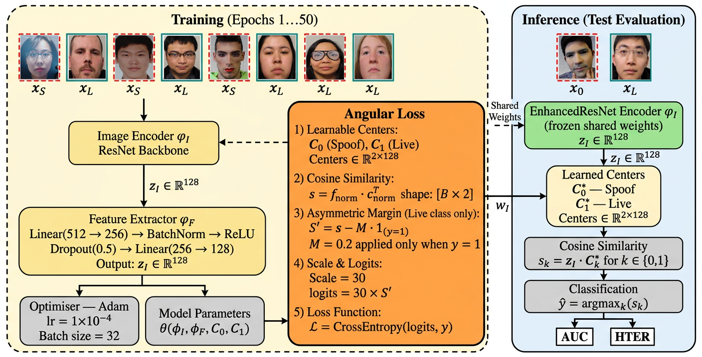
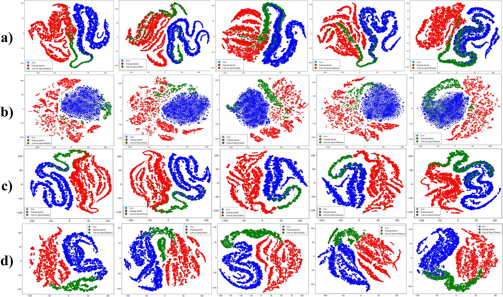

# AAML: Asymmetric Angular Margin Learning for Open-Set Face Presentation Attack Detection

Official implementation of **"Asymmetric Angular Margin Learning for Open-Set Face Presentation Attack Detection"** (currently under review).

> Face presentation attack detection (PAD) is usually treated as a closed-set binary
> classification problem, limiting generalisation to unseen attacks. This repository
> implements **AAML**, an asymmetric angular-margin discriminative learning framework
> that enforces tight hyperspherical compactness **only** on the live class, while
> allowing spoof representations to remain distributed — better reflecting the
> heterogeneous nature of presentation attacks.

<p align="center">
  
</p>

**Figure:** Overview of the proposed Leave-One-Spoof-Out training and inference framework based on Asymmetric Angular Margin Loss. During training, face images (live: $y=1$, spoof: $y=0$) are fed into an EnhancedResNet encoder ($\phi_I$) followed by a feature extractor ($\phi_F$) to produce 128-dimensional embeddings $\mathbf{z}_I \in \mathbb{R}^{128}$. 
    The Angular Margin Loss employs two learnable centers $\mathbf{C}_0$ (Spoof) and $\mathbf{C}_1$ (Live), computes cosine similarity, and applies an asymmetric margin ($M = 0.2$) exclusively to live-class logits before scaling ($s = 30$) and cross-entropy classification. 
    During inference, the frozen shared encoder maps unseen test samples to the same embedding space, where classification is performed via cosine similarity to the learned centers. Performance is evaluated using AUC and HTER metrics.

## Highlights

- **Asymmetric angular margin**: margin applied exclusively to the live class, unlike symmetric losses (e.g., ArcFace) that constrain all classes equally.
- **Leave-One-Spoof-Out (LOSO) protocol**: evaluates generalisation to unseen attack types not seen during training.
- State-of-the-art results on **Oulu-NPU**, **CASIA-MFSD**, **Replay-Attack**, **MSU-MFSD**, and **SiW-Mv2**.

## Repository Structure

```
AAML-FacePAD/
├── config.py            # All paths & hyper-parameters (edit this, no CLI args needed)
├── dataset.py            # Leave-One-Spoof-Out dataset / dataloader construction
├── transforms_utils.py   # Train/test image transforms
├── models.py              # EnhancedResNet50 backbone + projection head
├── losses.py              # Angular loss with learnable class centres
├── visualize.py           # Feature scatter, t-SNE, confusion-matrix plots
├── evaluate.py            # APCER / BPCER / ACER evaluation
├── train.py               # Main training entry point
└── requirements.txt
```

## Installation

```bash
git clone https://github.com/RZASHFUOH24-Research/AAML-FacePAD.git
cd AAML-FacePAD
python -m venv venv
source venv/bin/activate      # on Windows: venv\Scripts\activate
pip install -r requirements.txt
```

## Dataset Preparation

Organise your dataset root as one **live** folder plus one folder per **spoof type**:

```
<ROOT_DIR>/
├── Live/
│   ├── img_0001.jpg
│   └── ...
├── Replay/
├── Print/
├── Mask/
├── Makeup/
└── Partial/
```

This layout matches the **SiW-Mv2 coarse-grained** protocol used in the paper
(Replay / Print / Mask / Makeup / Partial). For the fine-grained LOO protocol,
simply list the fine-grained sub-attack folder names in `SPOOF_FOLDERS`.

## Configuration

All settings live in `config.py` — no command-line arguments needed. Edit the values
you need before running training, most importantly:

```python
ROOT_DIR = r"path/to/your/dataset"
LIVE_FOLDER_NAME = "Live"
SPOOF_FOLDERS = ["Replay", "Print", "Mask", "Makeup", "Partial"]
LEFT_OUT_SPOOF = "Partial"          # attack type held out for testing
MODEL_SAVE_DIR = r"path/to/save/checkpoints"

BATCH_SIZE = 32
EPOCHS = 50
LEARNING_RATE = 1e-4
FEATURE_DIM = 128
```

## Training

```bash
python train.py
```

This will:
1. Build the Leave-One-Spoof-Out train/test split.
2. Train the `EnhancedResNet50` encoder jointly with the learnable angular class centres.
3. Save a checkpoint per epoch to `MODEL_SAVE_DIR`.
4. Generate feature-scatter and t-SNE plots for the final epoch.
5. Run test-set evaluation and report **APCER / BPCER / ACER**, plus a confusion matrix.

## Results

Example results reported in the paper (see manuscript for full tables):

| Dataset | Metric | Value |
|---|---|---|
| Oulu-NPU (complete protocol) | ACER | **0.32%** |
| CASIA-MFSD / Replay-Attack / MSU-MFSD (cross-type) | Avg. AUC | **99.34%** |
| SiW-Mv2 (fine-grained LOO) | Avg. HTER / AUC | **4.67% / 97.40%** |
| SiW-Mv2 (coarse-grained) | Avg. HTER / AUC | **6.25% / 98.01%** |

<p align="center">
  
</p>

**Figure:** t-SNE visualisation of feature embeddings across five leave-one-out protocols. Rows correspond to (a) Binary Cross-Entropy (BCE), (b) Deep SVDD, (c) ArcFace, and (d) the proposed Asymmetric Angular Margin Loss (AAML). **Blue** points denote Live samples, **Red** points denote Known Spoofs used for training, and **Green** points denote Unseen Attacks used for testing. While ArcFace (Row 3) encourages symmetric compactness, the proposed AAML (Row 4) allows spoof samples to form a more distributed manifold, providing clearer separation between unseen attacks and the live cluster.


## Citation

If you use this code, please cite our paper (citation details will be added once published):

```bibtex
@article{sheikhfathollahi2026aaml,
  title   = {Asymmetric Angular Margin Learning for Open-Set Face Presentation Attack Detection},
  author  = {Sheikhfathollahi, Mohammadreza and Parkinson, Simon and Khan, Saad},
  journal = {Under Review},
  year    = {2026}
}
```
